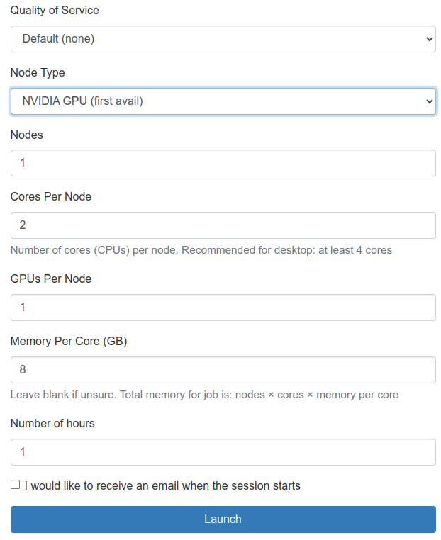

# Project 1 - CUDA Matrix Multiplication

## Objectives
The objective of this assignment is to introduce you to parallel programming using CUDA by implementing a tiled matrix multiplication algorithm. You will write CUDA code to multiply two matrices using shared memory and understand the principles of parallelism in GPU programming. This assignment serves as preparation for Project #2, where you will further optimize your CUDA code for performance.

>Note: Project #1 is functional capability only and has no performance requirements. Therefore you can **always select NVIDIA GPU (first avail)** on the ICE cluster for this project.

## Instructions
These instructions assume that you have already access to the PACE ICE cluster. The request for this access is done by the course staff at the start of the semester. The PACE staff is responsible for granting access and because we aren't the only ones that need access, it may not be available on day one of the course.

### Task #1: Connect to the ICE Cluster

1. Connect to the Georgia Tech VPN using teh GlobalProtect VPN Client.

    - You can go to https://vpn.gatech.edu and login with your GaTech username. 
    - Review the "Getting Started With VPN FAQ"
    - For this course you will be using the "VPN Client" to connect to the ICE cluster. (The Clientless VPN will not work.)
    - Follow the instructions in the FAQ to download and install the correct client.
    
2. Login to https://ondemand-ice.pace.gatech.edu/pun/sys/dashboard     

3. On the Menu bar: Interactive Apps > Interactive Desktop

4. Select ‘NVIDIA GPU (first avail)’ in Node Type dropdown to be able to run CUDA (Note that you can/should always develop with "first available" NVIDIA GPU.)  For grading purposes on this project we will use a "first available" GPU.

    You should configure your node as shown in the image and listed here:

    - QoS - Default (none)
    - Node Type - NVIDIA GPU (first avail)
    - Nodes - 1
    - Cores Per Node - 2
    - GPUs Per Node - 1
    - Memory Per Core (GB) - 8
    Number of hours - defaults to 1 but set it to how long you plan to work

    Click "Launch" to submit your request

    


### Task #2: Understanding Matrix Multiplication

Watch Modules 1, 2, and 3 of the provided course modules to gain a foundational understanding of CUDA programming and parallelism.

### Task #3: CUDA Tiled Matrix Multiplication

You will implement a CUDA kernel for matrix multiplication using a tiled approach. In this approach, the matrices are divided into smaller tiles, and each thread block is responsible for computing a portion of the resulting matrix.

Your CUDA kernel must contain the following components:

- **Tile size:** Decide on a suitable tile size for your implementation. You can change the #define (TILE_WIDTH) in the code to set your tile size. 

    > As an optional task, you can experiment with varying the tile sizes.

- **Use shared memory:** Utilize shared memory to store tiles of the input matrices.

- **Thread coordination:** Properly coordinate threads within a thread block to compute the result.

- **Program Flow:** Your CUDA code will include the following steps (further details provided in the source file):
    - Copy matrices of tile size from A and B from the host to the shared memory on the device.
    - Perform matrix multiplication on the tiles.
    - Sum up the partial sums to obtain the final answer for each element of the resultant matrix.
    - Write to the correct index in matrix C (location on host) passed to the kernel function.

- **Support for matrix sizes 16, 128, 512, 1024:**  Only square matrices need to be supported (e.g. 16x16, 128x128 etc.) You may experiment with other sizes for your own learning.

### Task #4: Running Your Code On The ICE Cluster
These instructions assume you have requested a GPU instance on the ICE cluster.  It also assumes you have your completed kernel_pr1.cu file on the cluster.

From a terminal execute the following commands to run your code:

```
module load cuda gcc/12.3.0     // sets up environment for nvcc
nvcc kernel_pr1.cu              // compile code 
./a.out -m <width of matrix>    // run 
```

## Submission Requirements
You will submit the GPU kernel code (“kernel_pr1.cu”) with the kernel function - “MatrixMulCUDA” implemented. Upload kernel_pr1.cu to the assignment in GradeScope.
 
 
## Grading Policy
Total points: 5

Your assignment will be graded based on the following criteria:

- Correctness of the GPU kernel code:
    - We will check whether "SUCCESS" is printed for each test case to determine correctness.
    - The provided frame will compare the GPU results and CPU results and print out "SUCCESS".
- Proper utilization of shared memory and thread coordination. (If the code is not using shared memory, you will get only 50% of your scores) 
- Matrix tiling: The code must use tiled matrix multiplication 


## Additional Resources
You may find these resources helpful

- NVIDIA CUDA Toolkit Documentation: https://developer.nvidia.com/cuda-toolkitLinks to an external site.
- CUDA Programming Guide: https://docs.nvidia.com/cuda/cuda-c-programming-guide/index.htmlLinks to an external site.
- CUDA C++ best practice guide (10.2.3.3)  (https://docs.nvidia.com/cuda/cuda-c-best-practices-guide/index.html#shared-memory-in-matrix-multiplication-c-aatLinks to an external site.)
- Tiled matrix multiplication:  https://penny-xu.github.io/blog/tiled-matrix-multiplication Links to an external site.
- YouTube videos https://youtu.be/jhmgti7OKlQ Links to an external site.
 
## Optional tasks
No submission is required for this section and it is not part of your grade.

Vary the tile size for matrices of different sizes and compare the performance benefits between small matrix multiplication and large matrix multiplication to understand the differences in performance benefits.

## FAQ 
Q. I see "This site can’t be reached" message when I typed https://ondemand-ice.pace.gatech.edu/. What should I do? 

A. Please make sure you have connected to Georgia Tech's VPN service using the GlobalProtect VPN client. 

Q. How do you upload files to the GPU machine? 

A.  You can use GUI from the ondemand-ice homepage. Please see the following figure 

 
 
Q. When I typed nvcc, it says command not found. what should I do? 

A. Please type: module load cuda gcc/12.3.0 

You can also put this command in your bash file.  (e.g. bashrc) 